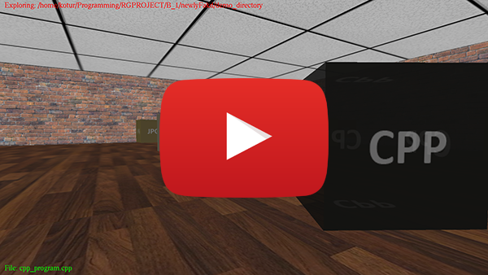

# Sense File e(X)plorer (RG26-sensefx)

## Requirements
   Linux, [g++ (c++17)](https://gcc.gnu.org/), [OpenGL](https://www.opengl.org/), [glut](https://www.opengl.org/resources/libraries/glut/), [glm](https://glm.g-truc.net/0.9.8/index.html")

## Instalacija
### Ubuntu/Debian
      sudo apt-get install freeglut3-dev libglm-dev
### Arch/Manjaro Linux
      sudo pacman -Sy freeglut glm

## Kompilacija
Shell programom doći u direktorijum projekta i ukucati: `make`

## Primer pokretanja programa
U direktorijumu projekta ukucati:
     `./senseFX demo_directory`

## Kontrole
### Tastatura
| Key              | funkcija                         |
| ---------------- |:--------------------------------:|
| w,s,a,d          | Kretanje                         |
| h,j,k,l          | Rotiranje kamere                 |
| e                | Ulazak u direktorijum            |
| space            | Skok                             |
| f                | Uključivanje/Isključivanje lampe |

**Miš** - Look around (rotiranje kamere)

## NAPOMENA
* Projekat je još uvek u fazi razvoja, neke funkcionalnosti još uvek nisu implementirane, kod je potrebno dodatno "isčistiti" i ulepšati. Takođe velika je verovatnoća da postoje bug-ovi.
* Ovaj projekat je moj prvi projekat i susret sa programskim jezikom C++, do sada nisam imao iskustva sa ovim jezikom ali jesam sa drugim objektno-orijentisanim jezicima.

## PREUZET KOD (tuđi):
* Kod za učitavanje .bmp fajlova (image.h i image.cpp): [objloader](http://poincare.matf.bg.ac.rs/~ivan/files/rg/vezbe/07/32_texture.tar.bz2)
* Kod za učitavanje .obj fajlova (objloader.h i objloader.cpp): [imgloader](http://poincare.matf.bg.ac.rs/~ivan/files/rg/vezbe/07/32_texture.tar.bz2)

## INFO
Za više informacija posetiti Wiki sekciju projekta: [Wiki](https://github.com/MATF-RG17/RG026-sensefx/wiki)
